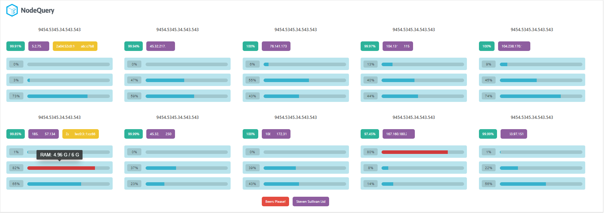

# NodeQuery Dashboard Widget for WordPress
Adds a widget to the Dashboard showing your NodeQuery monitored server details. Requires an API key from NodeQuery. This is an unofficial plugin.

WordPress Repo: https://wordpress.org/plugins/dashboard-widget-nodequery/

## Description

A simple unofficial plugin that shows the following stats from your NodeQuery account:

* Server availability
* Server load and load average
* Disk Usage
* RAM Usage

To generate an API key, go to your NodeQuery Account Settings -> API Settings: https://nodequery.com/settings/api

## Installation

Use the automatic installer via WordPress or download the plugin and:

1. Upload the plugin files to the `/wp-content/plugins/dashboard-widget-nodequery` directory
1. Activate the plugin through the 'Plugins' screen in WordPress
1. View the Dashboard to configure the settings.
